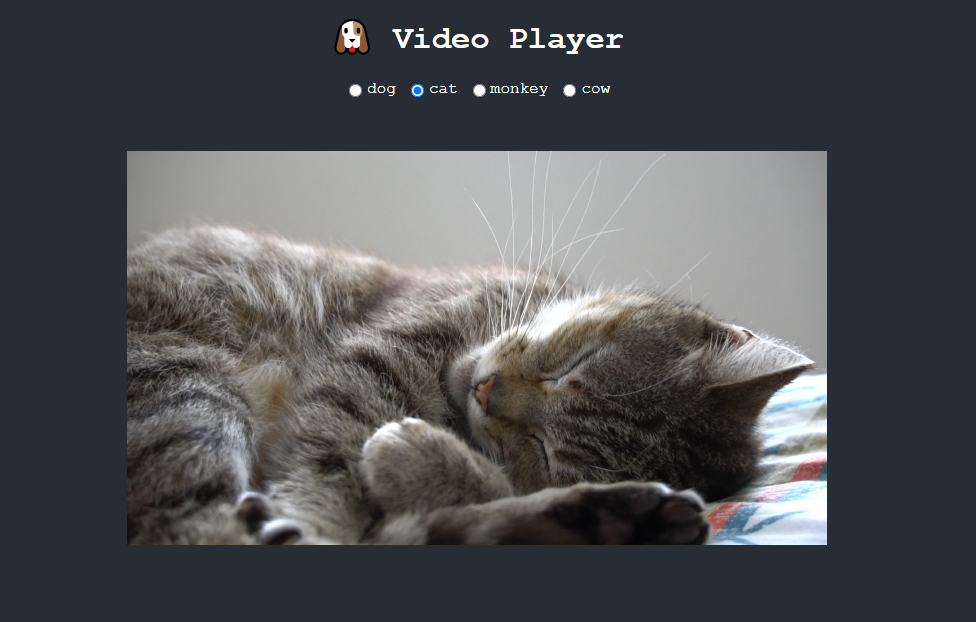

# React Projects

1. **Shopping List**

   - A shopping list application that allows users to add and remove items. Great for understanding state management and DOM interaction in React.

   

---

2. **Video Player**

   - An interactive video player that allows users to play, pause, and seek within videos. Ideal for learning how to handle media events and HTML5 API integration.

   

---

3. **BMI Calculator**

   - A Body Mass Index (BMI) calculator that lets users input their height and weight to calculate their BMI. Useful for practicing user input handling and dynamic calculations.

   

---

4. **Rock Paper Scissors**

   - An interactive rock, paper, scissors game where users can play against the computer. Great for understanding game logic and state management.

   

---

## Installation

To install dependencies for all projects, run:

```bash
npm run install:all
```

## Running the Projects

To start an individual project, use the following commands:

**Shopping List**

```bash
npm run start:shopping-list
```

**Video Player**

```bash
npm run start:video-player
```

**BMI Calculator**

```bash
npm run start:bmi-calculator
```

**Rock Paper Scissors**

```bash
npm run start:rock-paper-scissors
```
